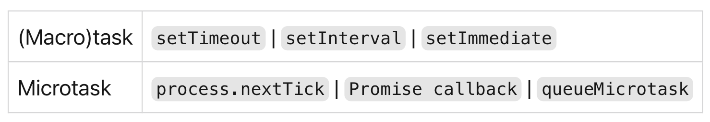

# Вопросы CoreJS

## ТИПЫ ДАННЫХ:

- [Перечислите все типы данных](topics/types/types.md)
- [Как узнать какой типа данных перед нами?](topics/types/typeof.md#typeof)
- [Почему typeof null === 'object'?](topics/types/typeof.md#null-object)


- Почему typeof function() {} === 'function'?
  Функции не являются отдельным базовым типом в JavaScript, а подвидом объектов. Но typeof выделяет функции отдельно, возвращая для них "function". На практике это весьма удобно, так как позволяет легко определить функцию.
- В чем их разница между null и undefined?

  undefined - получается при попытке получить значение там, где значения нет.
  null — явное «зануливание» переменной (object = null), когда ссылка на объект больше не требуется.
  Упрощённо: JavaScript использует undefined, а программисты должны использовать null.

- Как создать объект? (три способа)

1. С использованием литерального синтаксиса: const person = {};
2. С использованием ключевого слова «new»: const person = new Object();
3. Использовать метод Object.create(proto, properties) - где
    proto - oбъект, который должен быть прототипом вновь созданного объекта,
    properties - необязательный, можно указать дескртипторы свойст объекта - [настройки конфигурации объекта](https://learn.javascript.ru/property-descriptors)

- Что такое NaN? typeof NaN.

  NaN - это результат любого бессмысленного вычисления (ошибка), например:

  ```JS
  console.log( "не число" / 2 ) // NaN
  ```

  Если где-то в математическом выражении есть NaN, то оно распространяется на весь результат (с одним исключением):

  ```JS
  console.log( NaN + 1 ) // NaN
  console.log( NaN * 10 ) // NaN
  console.log( NaN ** 0 ); // 1 (исключение)
  ```

  Математические операции в JavaScript «безопасны». Мы можем делать что угодно: делить на ноль, обращаться с нечисловыми строками как с числами и т.д.
  Скрипт никогда не остановится с фатальной ошибкой (не «умрёт»). В худшем случае мы получим NaN как результат выполнения.

  ```JS
  typeof NaN === "number"
  ```

- NaN === NaN ? Почему?

  Так как NaN - это результат любого бессмысленного вычисления, он не равен результату какого-то другого бессмысленного вычисления. Поэтому:

  ```JS
  NaN == NaN // false
  NaN === NaN // false
  NaN !== NaN // true
  ```

- Тогда как узнать что перед нами NaN?

  Использовать метод Number.isNaN() или функцию isNaN(). Обратите внимание на разницу между ними:

  isNaN() вернёт true, если значение в настоящий момент является NaN, или если оно станет NaN после того, как преобразуется в число:

  ```JS
  isNaN(NaN); // true
  isNaN('hello world');// true
  ```
  
  Number.isNaN() вернёт true, только если текущим значением является NaN:

  ```JS
  Number.isNaN(NaN); // true
  Number.isNaN('hello world');// false
  ```
  
- Что такое Infinity?

Infinity является числовым значением, представляющим математическую бесконечность и сохраняет его поведение.

```JS
typeof Infinity === "number"
console.log(Infinity + 1); // Infinity
console.log(Math.pow(10, 1000)); // Infinity
console.log(Math.log(0)); // -Infinity
console.log(1 / Infinity); // 0
```

- isFinite() что это за функция?

  Oпределяет, является ли переданное значение конечным числом. Если необходимо, параметр сначала преобразуется в число.

  ```JS
  isFinite(Infinity); // false
  isFinite(NaN); // false
  isFinite(-Infinity); // false

  isFinite(0); // true
  isFinite(2e64); // true

  ```

- 0.1 + 0.2 === 0.3 ? Почему?
  Наиболее часто встречающаяся ошибка при работе с числами в JavaScript – это потеря точности.
  ```JS
  console.log(0.1 + 0    .2 === 0.3) // false
  console.log( 0.1 + 0.2 ); // 0.30000000000000004
  ```
  Число хранится в памяти в бинарной форме, как последовательность бит – единиц и нулей. Но дроби, такие как 0.1, 0.2, которые выглядят довольно просто в
  десятичной системе счисления, на самом деле являются бесконечной дробью в двоичной форме.

  Решить эту проблему можно — округлить результат используя метод toFixed(n), где n - необязательный параметр, обозначающий количество цифр после десятичной
  запятой:
  ```JS
  let sum = 0.1 + 0.2;
  console.log( sum.toFixed(2) ); // 0.30
  ```

  Помните, что метод toFixed всегда возвращает строку.
- Числовые методы приведения строки в число.

  Для явного преобразования к числу можно использовать + или Number(). Если строка не является в точности числом, то результат будет NaN:

  ```JS
  console.log( +"100px" ); // NaN
  ```

  Чтобы «читать» числа из строк, в JS предусмотрены методы parseInt и parseFloat. Если в процессе чтения возникает ошибка, они возвращают полученное до ошибки число. Функция parseInt возвращает целое число, а parseFloat возвращает число с плавающей точкой:

  ```JS
  alert( parseInt('100px') ); // 100
  alert( parseFloat('12.5em') ); // 12.5

  alert( parseInt('12.3') ); // 12, вернётся только целая часть
  alert( parseFloat('12.3.4') ); // 12.3, произойдёт остановка чтения на второй точке

  alert( parseInt('a123') ); // NaN, на первом символе происходит остановка чтения
  ```

- Можем ли к числу применять .toString(). Какая у этого метода особенность?

  Да, можем. Метод num.toString(base) возвращает строковое представление числа num в системе счисления base.

  ```JS
  const num = 255;

  console.log( num.toString(16) );  // ff
  console.log( num.toString(2) );   // 11111111
  ```

  Если нам надо вызвать метод непосредственно на числе, как toString в примере выше, то нам надо поставить две точки .. после числа.

  ```JS
  console.log( 123456..toString(36) ); // 2n9c
  ```

  Если мы поставим одну точку: 123456.toString(36), тогда это будет ошибкой, поскольку синтаксис JavaScript предполагает, что после первой точки начинается
  десятичная часть.

- Что такое Math? Приведите примеры.

  Math - это встроенный в JS объект, который предоставляет математические операции и константы. Например:

  Math.PI
  Math.random()
  и пр. [см. тут](https://developer.mozilla.org/en-US/docs/Web/JavaScript/Reference/Global_Objects/Math)

- Mетоды строк. Как получить подстроку.

1. Строка, итерируемая сущность, поэтому мы имеем доспут к индексам и длине строки:
   str.length, str[0], str.at(0), str.indexOf(substr, pos) и пр.
2. Методы toLowerCase() и toUpperCase() меняют регистр символов.
3. Поиск совпадения includes, startsWith, endsWith
4. Получение подстроки:
   В JavaScript есть 3 метода для получения подстроки: substring, substr и slice.
   str.slice(start [, end]) - возвращает часть строки от start до (не включая) end.
   str.substring(start [, end]) - возвращает часть строки между start и end.
   str.substr(start [, length]) - возвращает часть строки от start длины length.

- Что будет в консоли и почему:

  ```JS
  let str = "Привет!"
  str[0]= "п"
  console.log(str)
  ```

  Будет:

  ```JS
   console.log(str) // "Привет!"
  ```

  Содержимое строки в JavaScript нельзя изменить. Нельзя взять символ посередине и заменить его. Как только строка создана — она такая навсегда.

- Что такое шаблонные строки? Перечисли особенности.

  Шаблонные строки — это ещё один способ создания строк, наравне с одинарными или двойными кавычками. Шаблонные строки объявляются с помощью обратных кавычек.
  Особенности:

1. Шаблонная строка может быть многострочной, все переносы строк в ней будут сохранены.
2. В шаблонной строке с помощью синтаксиса ${ } можно использовать любые выражения JavaScript.
3. Любой нестроковый результат (например, объект), вне ${ }, будет приведён к строке.

- Что такое конкатенация?

  Операция соединения строк в программировании называется конкатенацией. Объединение строк в JavaScript использует оператор плюс (+).

  ```JS
  console.log('Dragon' + 'stone')// Dragonstone
  ```

- Что такое регулярные выражения? Метод для работы с ними. Приведите примеры.

  Регулярные выражения - это шаблоны, используемые для сопоставления последовательностей символов в строках.
  В JavaScript регулярные выражения реализованы отдельным объектом RegExp и интегрированы в методы строк.
  Регулярное выражение состоит из шаблона и необязательных флагов.
  Методы:

1. Поиск. Метод str.match(regexp) ищет совпадения: все, если есть флаг g, иначе только первое.
2. Замена. Метод str.replace(regexp, replacement) заменяет совпадения с regexp на replacement: все, если у регулярного выражения есть флаг g, иначе только первое.
3. Совпадение. Метод regexp.test(str) возвращает true, если есть хоть одно совпадение, иначе false.

## ПРИВЕДЕНИЕ ТИПОВ ДАННЫХ

- Какие типы данных можно привести? Как? Явно и неявно.


  Виды преобразования типов:   
1. Приведение числа к строке.   
   Явно: с помощью вызова встроенной функции String() `console.log(String(2))` или с помощью вызова метода .toString()(1) `console.log(2..toString(1))`   
   Неявно: с помощью “прибавления” к числу пустой строки. `console.log(2 + '')`   
2. Приведение строки к числу.   
   Явно: с помощью вызова встроенной функции Number() `console.log(Number('22'))` или с помощью вызова встроенных функций parseInt()(1) и parseFloat() 
   `console.log(parseInt('123.123')) // 123
    console.log(parseFloat('123.123')) // 123.123
   ` .   
   Неявно: с помощью унарного оператора ‘+’ `console.log(+'22')`    
3. Приведение значения к логическому типу.   
   Явно: с помощью вызова встроенной функции Boolean() `console.log(Boolean(10))`.    
   Неявно: с помощью двойного использования унарного оператора ‘!’ (не), в условном операторе if, при использовании логических операторов.   


## ОПЕРАТОРЫ:

- Перечислите операторы сравнения

  
  `==, ===` нестрогое и строгое равенство    
  `>, <` больше/меньше   
  `>=, <=`  больше/меньше или равно   
  `!=, !==` нестрогое и строгое неравенство    
  
- Разница между `==` и `===`

	Оператор строгого равенства === проверяет равенство без приведения типов, нестрогое равестно старается привести типы к одному.

  ```JS
  alert( 0 == false ); // true
  alert( '' == false ); // true

  alert( 0 === false ); // false

	```
- Перечислите логические операторы   

  В JavaScript есть четыре логических оператора:   
  `&& (И), || (ИЛИ), ! (НЕ), ?? (оператор нулевого слияния, см. след вопрос)`
1. || возвращает первое истинное значение или последнее ложное
    ```JS
    alert( null || 1 ); // 1 (первое истинное значение)
    alert( null || 0 || 1 ); // 1 (первое истинное значение)
    alert( undefined || null || 0 ); // 0 (последнее ложное значение)
    ```
2. && возвращает первое ложное значение или последнее истинное
    ```JS
    alert( 1 && 2 && null && 3 ); // null (первое ложное значение)
    alert( 1 && 5 ); // 5 (последнее истинное значение)
    ```
   Оператор && имеет больший приоритет, чем ||, так что он выполняется раньше.    
 3. Оператор НЕ представлен восклицательным знаком !.  
   Оператор принимает один аргумент и выполняет следующие действия:   
     -Сначала приводит аргумент к логическому типу true/false.   
     -Затем возвращает противоположное значение.   
   В частности, двойное НЕ !! используют для преобразования значений к логическому типу.    
   Приоритет НЕ ! является наивысшим из всех логических операторов, поэтому он всегда выполняется первым, перед && или ||.
	
- Что такое оператор нулевого слияния?
  
  Оператор нулевого слияния представляет собой два вопросительных знака ??. Оператор нулевого слияния возвращает первый определнный аргумент, иначе последний.   
  Иначе говоря, оператор ?? возвращает первый аргумент, если он не null/undefined, иначе последний.

  ```JS
  let user1;
  alert(user1 ?? "Аноним"); // Аноним

  let user2 = "Иван";
  alert(user2 ?? "Аноним"); // Иван (user2 существует)

  console.log(false ?? null) //false (false определен)

	```
- В чем разница ?? с логическим ИЛИ

  Важное различие между ними заключается в том, что:    
  || возвращает первое истинное значение или последнее ложное.   
  ?? возвращает первое определённое значение.
  Проще говоря, оператор || не различает разницы между falsy values, они все для него являются ложными значениями.
  В то время, для оператора ?? определены только два ложных значения: null и undefined.
  ```JS
  console.log(false ?? null) //false (false определен для ??)
  console.log(false || null) //null (|| возвращает последний false)
	```
  
- Перечислите falsy values

  Ложноподобное (falsy) значение — значение, которое становится false в булевом контексте.   
  `0, '', NaN, null, undefined, false`
  
- Важные моменты при работе с операторами сравнения:

  При нестрогом равенстве `==` undefined и null равны друг другу и не равны никаким другим значениям. Это специальное правило языка.
	 ```md
	 null == undefined // true
  ```
  При строгом равенстве `===` эти значения различны, так как различны их типы.
  ```md
	 null === undefined // false
  ```
  Ссылочные типы данных не равны друг другу, т.к. это независимые друг от друга объекты/массивы с разными ссылками. Даже если у них абсолютно одинаковое 
  наполнение.
   ```JS
	 {}=={} // false
	 {}==={} //false
	 []==[] //false
	 []===[]// false
   ```

 - К чему приводятся null и undefined при использовании математических операторов и операторов сравнения.

   При работе с математическими операторами `null` приводится к `0`, а `undefined` к `NaN`.   
   Сравним `null` с нулём:
   ```JS
   alert( null > 0 );  // (1) false
   alert( null == 0 ); // (2) false
   alert( null >= 0 ); // (3) true
   ```

   С точки зрения математики это странно. Результат последнего сравнения говорит о том, что "null больше или равно нулю", тогда результат одного из сравнений 
   выше должен быть true, но они оба ложны.

   Причина в том, что нестрогое равенство и сравнения > < >= <= работают по-разному. Сравнения преобразуют null в число, рассматривая его как 0. Поэтому 
   выражение (3) null >= 0 истинно, а null > 0 ложно.

   С другой стороны, для нестрогого равенства == значений undefined и null действует особое правило: эти значения ни к чему не приводятся, они равны друг другу и 
   не равны ничему другому. Поэтому (2) null == 0 ложно.

   Значение undefined несравнимо с другими значениями:
   ```JS
   alert( undefined > 0 ); // false (1)
   alert( undefined < 0 ); // false (2)
   alert( undefined == 0 ); // false (3)
   ```
   Почему же сравнение undefined с нулём всегда ложно?

   На это есть следующие причины:

   Сравнения (1) и (2) возвращают false, потому что undefined преобразуется в NaN, а NaN – это специальное числовое значение, которое возвращает false при любых 
   сравнениях.
   Нестрогое равенство (3) возвращает false, потому что undefined равно только null, undefined и ничему больше.

- Swich case конструкция, что это для чего что заменяет?

  Конструкция `switch` заменяет собой сразу несколько `if`.   
  Она представляет собой более наглядный способ сравнить выражение сразу с несколькими вариантами.
  Конструкция switch имеет один или более блок case и необязательный блок default.
  Пример использования switch:

  ```JS
  let a = 2 + 2;
  switch (a) {
    case 3:
      alert( 'Маловато' );
      break;
    case 4:
      alert( 'В точку!' );
      break;
    case 5:
      alert( 'Перебор' );
      break;
    default:
      alert( "Нет таких значений" );
  }
  ```

  Здесь оператор switch последовательно сравнит a со всеми вариантами из case.   
  Сначала 3, затем – так как нет совпадения – 4. Совпадение найдено, будет выполнен этот вариант, со строки alert( 'В точку!' ) и далее, до ближайшего break, 
  который прервёт выполнение.
  
- Обязателен ли default? A break?

  Нет, блок `default` необязательный. Как и `break`.   
  Если break нет, то выполнение пойдёт ниже по следующим case, при этом остальные проверки игнорируются.
    ```JS
  let a = 2 + 2;
  switch (a) {
    case 3:
      alert( 'Маловато' );
    case 4:
      alert( 'В точку!' );
    case 5:
      alert( 'Перебор' );
    default:
      alert( "Нет таких значений" );
  }
  ```
  В примере выше последовательно выполнятся три alert:

  ```JS
  alert( 'В точку!' );
  alert( 'Перебор' );
  alert( "Нет таких значений" );
  ```

  
- Что такое тернарный оператор? Почему он называется тернарный?

  Тернарный или условный оператор используется в качестве сокращённого варианта инструкции `if...else`.   
  Синтаксис:
  ```JS
  let result = условие ? значение1 : значение2;
  ```
  Сначала вычисляется условие: если оно истинно, тогда возвращается значение1, в противном случае – значение2.   
  Его называют «тернарный», так как этот оператор, единственный в своём роде, имеет три аргумента.   
  
- Может ли мы создавать цепочку из тернарных операторов?

  Последовательность операторов вопросительного знака ? позволяет вернуть значение, которое зависит от более чем одного условия.   
  Но это считается анти паттерном, т.к. ухудшает читаемость кода, поэтому не стоит создавать цепочку тернарных операторов.   

  
- Что такое оператор запятая?

  Оператор запятая выполняет каждый из его операндов (слева направо) и возвращает значение последнего операнда.   
  Оператор запятая полностью отличается от запятой в массивах, объектах, аргументах и параметрах функции.
  ```JS
  let x = 1;
  x = (x++, x);
  console.log(x); // 2
  ```
  Вы можете использовать оператор запятая, когда необходимо включить несколько выражений в место, которое принимает только одно выражение. Наиболее частый пример 
  использования этого оператора - это передача нескольких параметров в цикл for.
  
- Что такое оператор расширения (разворота)? spread-оператор

  Spread-оператор позволяет расширить (развернуть) доступные для итерации элементы (например, массивы или строки)
  ```JS
  function sum(x, y, z) {
  return x + y + z;
  }
  const numbers = [1, 2, 3];
  console.log(sum(...numbers));// 6
  console.log(Math.max(...numbers));// 3
  console.log(...numbers);// 1,2,3
  ```
- JS операторы spread vs rest

  Когда мы видим `...` в коде, это могут быть как остаточные параметры (rest), так и оператор расширения (spread).
  Как отличить их друг от друга:   
  Если `...` располагается в конце списка параметров функции, то это «остаточные параметры». Он собирает остальные неуказанные аргументы и делает из них массив.   
  Если `...` встретился в вызове функции или где-либо ещё, то это «оператор расширения». Он извлекает элементы из массива.


## ПЕРЕМЕННЫЕ, ХОИСТИНГ

- как можно объявить переменную?
  
  Переменную в JavaScript можно объявить 4 способами - автоматически (эквевалентно **var**, работает только в **non strict mode**) и ключевыми словами: **var, let** и **const**.

  Пример объявление одной переменной разными способами:
  ```JS
  x = 23; // x будет объявлена автоматически, как только интерпритатор дойдёт до этой строки (в strict mode - будет ошибка!)
  var x = 23;
  
  const x = 23;
  let x = 23;
  ```
- что такое переменная?

	Переменная - это **коробочка**. Мы можем **положить** в эту коробочку какое-то значение, которое она будет **хранит** внутри себя.
 	Также мы можем **повесить бирочку** на эту коробочку, чтобы описать что она содержит, для того чтобы **найти** её в будущем.
- разница между let, var и const

	С первого взгляда переменные очень похожи друг на друга, но есть несколько ключевых отличий:
  1) **let**, **var** - переменные, которые **могут** изменять своё значение в процессе работы приложения (runtime). Могут быть объявлены без инициализирующего 		значения. <br>
  **const** в свою очередь - переменная, которые **НЕ может** изменять своё значение в процессе работы приложения, от слова константа. Также при объявлении const 	мы объявляем переменную, и сразу же присваиваем значение. 

	Пример работы **let** и **var**:

	```JS
	let a = 1;
	a = 2; // Переменная мутабельная
	
	var b = 1;
	b = 2; // Работает таким же образом
	
	let a; // Переменная может быть объявлены без инициализирующего значения. Будет сожержать в себе undefined
	var a; // Та же ситуация
  ```

	Пример работы **const**:
	```JS
	// bad 👎
	const a; // Ошибка - переменная объявлена без инициализирующего значения
	
	// nice 👍
	const a = 23; // Объявили и на этой же строке присвоили значение

 	// bad 👎
	const a = 23;
 	a = 18; // Ошибка - переменная имутабельная
  ```

	2) Одно из основных отличий переменных **let** и **const** (ES2015) от **var**, как раз таки почему их и добавили - это очень нестандартное поведение **var**. 	<br>
 **var** - обладает хоистингом, это означает то, что переменную можно использовать до её объявления. 

	Пример работы **var**:
	
	```JS
	console.log(a) // undefined
	var x = 23;
	```

	Пример работы **let** и **const**:
	
	```JS
	console.log(x, y) // Ошибка - пытаемся обратиться к переменным до их объявления
	
	let x = 23;
	const y = 18;
	```

	Это очень плохо, потому что мы ожидаем ошибку, но переменная - undefined, что ведёт за собой возможные неявные ошибки, которые очень сложно обнаружить и 	проблемы со входом в язык у других разработчиков, потому что это нестандартное поведение.

	3) Ещё одно очень важное отличие **var** от **let** и **const** - заключается в том, что **var** - **function scoped**, **let** и **const** - **block scoped**. <br>
	Это означает, что область видимости **var** - ограничивает только функции, когда область видимости **let** и **const** - **любой** блок кода.

	Пример работы **var**:

	```JS
	function foo() {
	  var a = 1;
	}

	console.log(a); // Ошибка переменная "заключена" внутри функции

	if (true) {
	  var a = 1;
	}

 	console.log(a); // 1
	// Переменная доступна вне блока

  for (var i = 0; i < 10; i++) {}

 	console.log(i); // 10
	// Переменная теже доступна вне блока. Любого блока.
	```

	Пример работы **let** и **const**:
	
	```JS
	function foo() {
	  let a = 1;
	  const b = 2;
	}

	console.log(a, b); // Ошибка - переменные недоступны вне функции
	
	if (true) {
	  let a = 1;
	  const b = 2;
	}
	
	console.log(a, b); // Также Ошибка - переменные недоступны вне блока
	```
	
	Также для **let** и **const** любой блок кода ограничивает их область видимости 
	
	```JS
	{
	  let a = 1;
	  const b = 2; // Даже такая запись считается блоком - переменные локальные внутри
	}
	
	console.log(a, b); // Ошибка - переменные недоступны вне блока
	```

	4) Последнее важное отличие **var** - заключается в том, что при создании переменной в глобальный объект Window, записывается свойство с таким же названием и значением. 
	
	```JS
	var myVariable = 23;
	console.log(window.myVariable); // 23
	```
	
	Как упоминалось раньше переменные, которые объявлены автоматически эквивалентны **var**, тоесть так же создаться свойство в глобальном объекте
	```JS
	test = 14
	console.log(window.test); // 14
	```
	 

- что такое хоистинг?
- какие функции всплывают?
- что будет если:
  `JS
	 console.log(a)
	 var a = 5;
	 `
- а если var заменить на let что измениться?
- что такое временная мертвая зона и зачем она нужна?
- что такое полифиллы. Приведи пример.

## ФУНКЦИИ:

- что такое функциональное программирование
- какие виды функций ты знаешь. Какие различия
- какие особенности у стрелочной функции
- что такое callback функция
- что такое функция высшего порядка?
- что такое чистая функция?
- что такое iife? Зачем?
- что такое функция конструктор
- что такое замыкание
- что такое new?
- что такое this?
- можем ли мы привязаться this к функции? Какие методы?
- особенности bind
- что такое замыкание

## OOP

<br><br>

<br><br>

- <b>Что такое OOP</b>

	Объектно-ориентированное программирование – это подход/методология, при котором вся программа рассматривается как набор взаимодействующих друг с другом объектов. У каждого объекта в системе есть свойства и поведение(методы). Такой подход помогает строить сложные системы более просто и естественно благодаря тому, что вся предметная область разбивается на объекты и каждый из них слабо связан с другими объектами.

	Основные задачи ООП — структурировать код, повысить его читабельность и ускорить понимание логики программы. Косвенно выполняются и другие задачи: например, повышается безопасность кода и сокращается его дублирование.

	Основные принципы, на которые опирается ООП парадигма:

	<b>

	1. Инкапсуляция
	2. Полиморфизм
	3. Наследование
	4. Абстракция

	</b>
	<br><br>

	Одна из [лучших прочитанных мною статей](https://habr.com/ru/articles/463125/) не тему ООП. И [ещё одна](https://habr.com/ru/articles/345658/)

- <b>Что такое инкапсуляция</b>

	Инкапсуляция – сокрытие поведения и данных объекта внутри него, способ спрятать сложную логику внутри объекта, предоставив пользователю лаконичный и понятный интерфейс для взаимодействия с сущностью. Вам не нужно знать как в мельчайших деталях работает кофеварка, её внутреннее устройство. Вы просто знаете, что нужно поставить чашку, засыпать кофе, налить воды и нажать кнопку. Детали работы скрыты, для пользования предоставлен удобный интерфейс. Приватные поля и методы, геттеры и сеттеры.

- <b>Что такое наследование</b>

	Наследование - это форма отношений между классами. Один класс может наследовать другой класс, его поля и методы. Наследовать - означает переиспользовать. После того, как класс объявляет себя наследником какого-то класса, соответствующие поля и методы появляются в нем автоматически. Наследник берёт от родителя его методы и свойства, и дополняет их, либо переопределяет, своими методами и свойствами. Сотрудник/менеджер, прямоугольник/квадрат, публикация на сайте/статья или объявление.

- <b>Что такое полиморфизм</b>

	Полиморфизм - это переопределение поведения. Способность функции использовать данные разных типов, и действовать по разному в зависимости от этих данных. Один интерфейс: много реализаций. Углерод может быть и в форме алмаза, и в форме графита, и в форме карбона.
	<br><br>

	<b>Разделяют два вида полиморфизма:</b>

	- Параметрический полиморфизм, который позволяет описывать вычисления в общем виде, абстрагируясь от того, какие типы будут использованы Параметрически полиморфные функции еще также называются обобщенными (Generic).

	- Специальный полиморфизм. В нем происходит диспетчеризация (перенаправление) к одной или нескольким функциям для конкретного типа аргумента.

	Из этого можно сделать следующие выводы:

	- Универсально полиморфные функции работают на неограниченном количестве типов, причем функция будет выполняться для любого типа аргументов.
		Пример: функция сортировка массива: ей без разницы что сортировать, числа, строки, или кошек с собаками. Так же неявное приведение типов считается полиморфизмом.

	- Специально полиморфные функции работают с конечным набором конкретных типов, не связанных между собой, где для каждого типа аргументов реализуется свой способ вычислений.

		Перегрузка — это разновидность специального полиморфизма. Такой вид полиморфизма позволяет объявлять функции с одним и тем же именем, но с разными типами аргументов и их количеством (арностью).
		Пример:

		```JS
			class Manager {
				constructor(name) {
						this.name = name;
				}
				greet() {
						return `I'm ${this.name} and I do very important work!`
				}
			}

			class SeniorManager extends Manager {
					constructor(name) {
							super(name)
					}
					greet() {
							return `${super.greet()} That you can't even imagine!`
					}
			}

			const pete = new Manager('Pete');
			const alan = new SeniorManager('Alan');

			console.log(pete.greet()) // I'm Pete and I do very important work!
			console.log(alan.greet()) //I'm Alan and I do very important work! That you can't even imagine!
		```

		Немного другая схема полиморфизма:
		<br><br>
		


	По ходу, ни один принцип ООП не обладает такой противоречивой информацией, и не вызывает так много дискуссий как полиморфизм. Очень объемная [статья на медиуме](https://medium.com/devschacht/polymorphism-207d9f9cd78) по этому поводу.

- Что такое ассоциация

	Ассоциация – это один из способов взаимодействия между классами, когда один класс включает в себя другой класс в качестве одного из полей. Ассоциация описывается словом «имеет». Если наследование описывается словом "является". "А" является сущностью "Б", то ассоциация описывается словом "имеет/владеет". "А" владеет сущностью "Б". Сама ассоциация имеет два частных случая: композицию и агреггацию.

- Что такое композиция

	Композиция - это когда вложенный объект не существует отдельно от класса, в который он включён. Другими словами, жизненный цикл дочернего объекта совпадает с жизненным циклом родительского.

- Что такое агрегация

	Агрегация – это когда экземпляр двигателя создается где-то в другом месте кода, и передается в конструктор автомобиля в качестве параметра. То есть, жизненный цикл дочернего объекта не зависит от жизненного цикла родительского, и может использоваться другими объектами.

- Что такое абстрактный класс

	Некий базовый класс, который не предполагает создания экземпляров. Мы <b>НЕ МОЖЕМ</b> использовать конструктор абстрактного класса для создания экземпляра класса. Абстрактные классы реализуют на практике один из принципов ООП — полиморфизм. Абстрактный класс может содержать (или не содержать) абстрактные методы и свойства. Например, в реальности не существует геометрической фигуры как таковой. Есть круг, прямоугольник, квадрат, но просто фигуры нет. Однако же и круг, и прямоугольник имеют что-то общее и являются фигурами.

- Что такое интерфейс

	Интерфейс описывает только поведение (методы) класса. Главное отличие класса от интерфейса — в том, что класс состоит из интерфейса и реализации. Интерфейс — то, что доступно при использовании класса извне.

	Более [подробно](https://habr.com/ru/articles/30444/)

- Что такое абстрактный метод

	Абстрактный метод - это некий метод, который задан, но ещё не определен, метод, реализация которого ещё отутствует. Абстрактный метод подлежит определению в классах-наследниках

- Что такое статический метод

	Метод принадлежащий самому классу, и не имеющий доступа к состоянию (полям) объекта, то есть к переменной this. В объявлении класса помечается ключевым словом static

- Что такое статическое свойство

	Свойство принадлежащее самому классу, и не имеющее доступа к состоянию (полям) объекта, то есть к переменной this. В объявлении класса помечается ключевым словом static. Статические свойства и методы наследуются.

- Что такое инстанс и инстанцирование

	Непосредственный экземпляр класса, его физическое воплощение. Сущность, которая занимает место в памяти, владеет всеми полями и методами класса.

- Что такое декоратор

	Декоратор — это структурный паттерн проектирования, который позволяет динамически добавлять объектам новую функциональность, оборачивая их в полезные «обёртки». Суть паттерна: вы помещаете целевой объект в другой объект-обёртку, который запускает базовое поведение объекта, а затем добавляет к результату что-то своё. В основе лежит агрегация или композиция.

	Пример: любая одежда — это аналог Декоратора. Применяя Декоратор, вы не меняете первоначальный класс и не создаёте дочерних классов. Так и с одеждой — надевая свитер, вы не перестаёте быть собой, но получаете новое свойство — защиту от холода. Вы можете пойти дальше и надеть сверху ещё один декоратор — плащ, чтобы защититься и от дождя.

	В TS декораторы объявляются через @decoratorName; В ванильном JS синтаксис декораторов не поддерживается. Но вы всё ещё можете писать свои декораторы самостоятельно. Все следующие примеры по декораторам будут написаны на TS.
	Отличная полноценная [статья](https://habr.com/ru/companies/otus/articles/531664/) по декораторам в JS.

- Что такое декоратор класса

	Это функция, которая оборачивает инстанс класса. С помощью декоратора, мы можем динамически добавлять обьектам новые свойства и методы. То есть мы как бы заворачиваем наш обьект в декоратор, как в superclass.

	Декоратор sealed с помощью функции Object.seal запрещает расширение прототипа класса User:

	```TS
		function sealed(constructor) {
			console.log("sealed decorator");
			Object.seal(constructor);
			Object.seal(constructor.prototype);
		}

		@sealed
		class User {
				constructor(name){
						this.name = name;
				}
				print() {
						console.log(this.name);
				}
		}
	```

- Что такое декоратор метода

	Декоратор метода также представляет функцию, которая принимает три параметра:

	Декоратор принимает следующие параметры:

	1. Функция конструктора класса для статического метода, либо прототип класса для обычного метода.
	2. Название метода.
	3. Объект интерфейса PropertyDescriptor.

	Декоратор readable с помощью выражения descriptor.writable = false; устанавливает, что метод, к которому применяется данный декоратор, не может быть изменен.

	```TS
		function readable (target: Object, propertyKey: string, descriptor: PropertyDescriptor) {
    	descriptor.writable = false;
		};

		class User {
				constructor(name){
						this.name = name;
				}

				@readable
				print() {
						console.log(this.name);
				}
		}
		let tom = new User("Tom");
		tom.print = function(){console.log("print has been changed");}
		tom.print();  // Tom
	```

- Что такое декоратор свойства

	Декоратор свойства представляет функцию, которая принимает два параметра: первый параметр представляет конструктор класса, если свойство статическое, либо прототип класса, если свойство нестатическое, а второй параметр представляет имя свойства.

	```TS
		function format() {
			return function(target, propertyKey) {
				let value;
				const getter = function() {
					return "Mr./Ms." + value;     // изменяем возвращаемое значение
				};
				const setter = function(newVal) {
					if(newVal.length > 2) {   // добавляем проверку на длину строки
							value = newVal
					}
				};
				// устанавливает геттер и сеттер для свойства
				Object.defineProperty(target, propertyKey, {
					get: getter,
					set: setter
				});
			}
		}

		class User {
			@format
			constructor(name){
					this.name = name;
			}
			print() {
					console.log(this.name);
			}
		}
		let tom = new User("Tom");
		tom.print();
		tom.name = "Tommy";
		tom.print();
		tom.name = "To";
		tom.print();
	```

- Что такое декоратор параметра

	Декоратор параметра объявляется прямо перед объявлением параметра. Функция декоратора принимает 3 параметра.

	1. конструктор класса, если метод статический, либо прототип класса, если метод нестатический.
	2. имя метода
	3. порядковый индекс параметра в списке параметров.

	Декоратор logParameter добавляет в прототип класса новое свойство metadataKey. Это свойство представляет массив, который содержит индексы декорированных параметров.

	Для чтения метаданных из свойства metadataKey применяется декоратор метода logMethod, который перебирает все параметры метода, находит значения параметров по индексам, которые определены декоратором параметра, и выводит на консоль названия и значения декорированных параметров.

	```TS
		function logParameter(target: any, key : string, index : number) {
			var metadataKey = `__log_${key}_parameters`;

			if (Array.isArray(target[metadataKey])) {
					target[metadataKey].push(index);
				}
				else {
					target[metadataKey] = [index];
			}
		}
		function logMethod(target: any, key: string, descriptor: PropertyDescriptor) {

				var originalMethod = descriptor.value;
				descriptor.value = function (...args: any[]) {

						var metadataKey = `__log_${key}_parameters`;
						var indices = target[metadataKey];

						if (Array.isArray(indices)) {
								for (var i = 0; i < args.length; i++) {

										if (indices.indexOf(i) !== -1) {
												var arg = args[i];
												var argStr = JSON.stringify(arg) || arg.toString();
												console.log(`${key} arg[${i}]: ${argStr}`);
										}
								}
								var result = originalMethod.apply(this, args);
								return result;
						}
						else {
								var a = args.map(a => (JSON.stringify(a) || a.toString())).join();
								var result = originalMethod.apply(this, args);
								var r = JSON.stringify(result);
								console.log(`Call: ${key}(${a}) => ${r}`);
								return result;
						}
				}
				return descriptor;
		}

		class User {

				private name: string;
				constructor(name: string){
						this.name = name;
				}
			@logMethod
				setName(@logParameter name: string){
						this.name = name;
				}
				print():void{
						console.log(this.name);
				}
		}
		let tom = new User("Tom");
		tom.setName("Bob");
		tom.setName("Sam");
	```

- Что такое декоратор геттера и сеттера

	Декоратор метода доступа принимает три параметра:

	1. конструктор класса для статического метода, либо прототип класса для обычного метода.
	2. название метода.
	3. объект PropertyDescriptor.

	```JS
		function validator(target, propertyKey, descriptor) {
			const oldSet = descriptor.set;

			descriptor.set = function(value) {
					if (value === "admin") {
							throw new Error("Invalid value");
					}
					if(oldSet!==undefined) oldSet.call(this, value);
			}
		}
		class User {
			constructor(name){
					this.name = name;
			}

			get name() {
					return this._name;
			}
			@validator
			set name(n) {
					this._name = n;
			}
		}
		let tom = new User("Tom");
		console.log(tom.name);
		tom.name= "admin";
		console.log(tom.name);
	```

- Что такое декоратор функции

	Декораторы функций — это такие же функции. Они принимают функцию в качестве аргумента и возвращают другую функцию, которая расширяет поведение функции-аргумента. Новая функция не изменяет функцию-аргумент, но использует ее в своем теле. Как я уже говорил, это во многом напоминает функции высшего порядка.

	Самый простой пример - валидация параметров функции. Ванильный JS.

	```JS
		//decorator function
	const allArgsValid = function(fn) {
		return function(...args) {
		if (args.length != fn.length) {
				throw new Error('Only submit required number of params');
			}
			const validArgs = args.filter(arg => Number.isInteger(arg));
			if (validArgs.length < fn.length) {
				throw new TypeError('Argument cannot be a non-integer');
			}
			return fn(...args);
		}
	}

	//ordinary multiply function
	let multiply = function(a,b){
		return a*b;
	}

	//decorated multiply function that only accepts the required number of params and only integers
	multiply = allArgsValid(multiply);
	multiply(6, 8); // 48
	multiply(6, 8, 7); // Error: Only submit required number of params
	multiply(3, null); // TypeError: Argument cannot be a non-integer
	multiply('',4); // TypeError: Argument cannot be a non-integer
	```

## ОБЪЕКТЫ.

- Создать объект через Object.create.


    Помимо способов создания объекта через литерал объекта и функцию конструктор, есть возможность создать объект с помощью метода Object.create(proto, propertiesObject?). Метод принимаем в качестве обязательного аргумента другой объект, который будет установлен в качестве прототипа создаваемого объекта.
    В качестве второго, необязательного, принимается объект, в котором ключи являются названиями свойств, а значения - их дескрипторами. Подробнее про дескрипторы ниже.

    Таким образом, Object.create(), предоставляет больший контроль над процессом создания объекта, позволяя сразу же устанавливать выбранный прототип, определять свойства и методы объекта, а также сразу конфигурировать их.

    [MDN Object.create()](https://developer.mozilla.org/ru/docs/Web/JavaScript/Reference/Global_Objects/Object/create)

- Дескрипторы свойств объекта.

    Как мы знаем, объект в JS это коллекция пар "Ключ - Значение". Если взглянуть чуть глубже, мы выясним, что под словом значение скрывается не только само значение, но и
    атрибуты (также называемые "флаги"), которые описывают свойство объекта. Помимо самого значения "value", их три:

    * writable – если true, свойство можно изменить, иначе оно только для чтения.
    * enumerable – если true, свойство перечисляется в циклах, в противном случае циклы его игнорируют.
    * configurable  – если true, свойство можно удалить, а эти атрибуты можно изменять, иначе этого делать нельзя.

    По умолчанию эти атрибуты скрыты, и обратившись к свойству объекта по ключи мы получим только значение "value".

    Чтобы получить полное описание свойства, необходимо использовать метод Object.getOwnPropertyDescriptor(obj, propertyName), который первым аргументом принимает целевой объект, а вторым имя свойства, описание которого мы хотим получить. В результате выполнения, метод вернет объект, который и называется property descriptor (дескриптор свойства).

    Пример:
    ```JS
	  let user = {
        name: "John"
      };

      let descriptor = Object.getOwnPropertyDescriptor(user, 'name');
      /* дескриптор свойства:
        {
          "value": "John",
          "writable": true,
          "enumerable": true,
          "configurable": true
        }
      */
	 ```

   Чтобы изменить дескриптор, следует использовать метод Object.defineProperty(obj, propertyName, descriptor), который принимает первый аргументом целевой объект, вторым имя свойства, и третьим объект-дескриптор. Следует помнить, что если в объекте-дескрипторе не будут указаны какие-то флаги, то их значение будет автоматически установлено false, что, если мы сделали это неосознанно, может повлечь за собой неочевидные проблемы в работе кода, в виде неизменяемого свойства, или свойства которое мы никак не сможем увидеть при перечислении.

    [MDN Object.defineProperty()](https://developer.mozilla.org/ru/docs/Web/JavaScript/Reference/Global_Objects/Object/defineProperty)

    [LearnJS Property descriptor](https://learn.javascript.ru/property-descriptors)


- Как копировать объект. Глубоко и нет. Нюансы JSON.stringify.

    Объект передается по ссылке. Это значит, что при попытке скопировать объект через обычное присвоение, мы всего лишь создадим еще одну ссылку на исходный объект, но не его копию.

    Есть два вида копирования, поверхностное, когда мы копируем свойства одного объекта, в свойства другого, при это если значение свойства копируемого объекта, в свою очередь является объектом, то копирования не произойдет, а создастся ссылка на тот же самый объект. В итоге мы получим два разных объекта, которые внутри себя будут ссылаться на одни и те же объекты.

    Чтобы этого избежать, используется глубокое копирование, которое создает копию не только копируемого объекта, но и всех вложенных, в результате чего мы получим два полностью независимых объекта.

    Для поверхностного копирования подходят методы:
    * Object.assign(target, ...sources), который первым аргументом принимает целевой объект, а последующими - исходные объекты, из которых будут скопированы все  _собственные_ и _перечисляемые_ свойства (помним про флаг enumerable, в дескрипторе свойства). К примеру следующий код создаст новый объект, скопировав туда все свойства объектов one и two, а затем запишет ссылку на него в переменную copy.
      ```JS
      let copy = Object.assign({}, one, two);
      ```
    * Синтаксис деструктуризации. Следующий код создаст копии свойств объекта one, затем "соберет" их в новый объект, ссылку на который, запишет в переменную copy
      ```JS
      let copy = {...one};
      ```

    С глубоким копированием сложнее, в части случаев, его можно выполнить комбинацией методов JSON.stringify() и JSON.parse(). Первый рекурсивно обойдет объект, и вернет его строчное представление в формате JSON, а второй десериализует это значение,  создав из него новый объект. Т.к. мы создаем новый объект из строки, мы избегаем любых связей между исходным и копируемым объектом. Главной проблемой, не позволяющей использовать этот подход всегда и везде, является то, что при преобразовании исходного объекта в JSON строку, пропускаются и, соответственно теряются при копировании, все

    * Свойства-функции (методы).
    * Символьные ключи и значения.
    * Свойства, содержащие undefined.

    Для полноценного глубокого копирования нет встроенных методов, способ с JSON не подходит, следует либо использовать сторонние библиотеки, либо писать функцию для глубокого копирования самостоятельно.

    [MDN Object.assign()](https://developer.mozilla.org/en-US/doc    s/Web/JavaScript/Reference/Global_Objects/Object/assign)

    [LearnJS JSON](https://learn.javascript.ru/json)

    [LearnJS Spread operator](https://learn.javascript.ru/rest-parameters-spread-operator#spread-operator)

- Перечисли встроенные методы объекта, для получения ключей, значений, и ещё один похожий метод.

  * Object.keys(source) - вернет массив ключей (названий свойств) объекта, переданного в качестве аргумента.
  * Object.values(source) - вернет массив значений свойств объекта, переданного в качестве аргумента.


  Следует помнить, что все вышеперечисленные методы игнорируют неперечисляемые свойства (флаг enumerable в дескрипторе свойства)

  [MDN Object.keys()](https://developer.mozilla.org/ru/docs/Web/JavaScript/Reference/Global_Objects/Object/keys)

  [MDN Object.values()](https://developer.mozilla.org/ru/docs/Web/JavaScript/Reference/Global_Objects/Object/values)

  [MDN Object.entries()](https://developer.mozilla.org/ru/docs/Web/JavaScript/Reference/Global_Objects/Object/entries)

- Что такое map и set? Чем map отличается от объекта.


    Map – это коллекция ключ/значение, как и Object. Но основное отличие в том, что Map позволяет использовать ключи любого типа (в т.ч другие объекты).
    Данная структура данных для работы использует следующие методы:

    * new Map() – создаёт коллекцию.
    * map.set(key, value) – записывает по ключу key значение value.
    * map.get(key) – возвращает значение по ключу или undefined, если ключ key отсутствует.
    * map.has(key) – возвращает true, если ключ key присутствует в коллекции, иначе false.
    * map.delete(key) – удаляет элемент (пару «ключ/значение») по ключу key.
    * map.clear() – очищает коллекцию от вс    ех элементов.
    * map.size – возвращает текущее количество элементов.
    * map.keys() – возвращает итерируемый объект по ключам,
    * map.values() – возвращает итерируемый объект по значениям,
    * map.entries() – возвращает итерируемый объект по парам вида [ключ, значение], этот вариант используется по умолчанию в for..of.

    В отличие от обычных объектов Object, в Map перебор происходит в том же порядке, в каком происходило добавление элементов.

    Set – это особый вид коллекции: «множество» значений (без ключей), где каждое значение может появляться только один раз.
    Данная структура данных для работы использует следующие методы:

    * new Set(iterable) – создаёт Set, и если в качестве аргумента был предоставлен итерируемый объект (обычно это массив), то копирует его значения в новый Set.
    * set.add(value) – добавляет значение (если оно уже есть, то ничего не делает), возвращает тот же объект set.
    * set.delete(value) – удаляет значение, возвращает true, если value было  в множестве на момент вызова, иначе false.
    * set.has(value) – возвр    ащает true, если значение присутствует в множестве, иначе false.
    * set.clear() – удаляет все имеющиеся значения.
    * set.size – возвращает количество элементов в множестве.

    Основным преимуществом структуры является то, что при повторных вызовах set.add() с одним и тем же значением ничего не происходит, за счёт этого как раз и получается, что каждое значение появляется один раз.

    Перебор возможен как с помощью метода for..of, так и используя forEach (в отличие от перебора методом forEach обычных массивов, при переборе Set callback принимает три аргумента: value, valueAgain, index. Это сделано для совместимости с объектом Map).

    [LearnJS Map and Set](https://learn.javascript.ru/map-set)


- Object.is

  Метод проверяет, являются ли значения _одинаковыми_. Метод не пытается выполнить приведение типов как нестрогое равенство, и в отличие от строгого равенства не считает +0 и -0 равными, а также считает NaN равному NaN.

  Метод применяется во внутренних реализациях некоторых методов языка. К примеру, при попытке изменения неизменяемого свойства, вызов Object.defineProperty выбросит ошибку, однако, если новое свойство равняется старому, изменений не произойдёт и ошибки не будет. Для проверки равно ли новое свойство старому используется Object.is()

  [MDN Object.is()](https://developer.mozilla.org/ru/docs/Web/JavaScript/Reference/Global_Objects/Object/is)

  [MDN Sameness](https://developer.mozilla.org/en-US/docs/Web/JavaScript/Equality_comparisons_and_sameness)


- Object.freeze() и Object.seal().

  Оба методы нужны для придания объекту иммутабельности (защиты от изменений).

  Метод Object.seal(obj) запечатывает объект, предотвращая добавление новых свойств к объекту и делая все существующие свойства не настраиваемыми. Допускается только изменять значение уже существующих свойств.

  Метод Object.freeze(obj) замораживает объект: это значит, что он предотвращает добавление новых свойств к объекту, удаление старых свойств из объекта и изменение существующих свойств или значения их атрибутов перечисляемости, настраиваемо сти и записываемости. Фактически объект становится полностью неизменным. Однако остается возможность изменять внутренние "подобъекты", если они, в свою очередь, не были заморожены или запечатаны.


  Для проверки, является ли объект замороженным или запечатанным используются методы Object.isSealed(obj), Object.isFrozen(obj)

  [MDN Object.freeze()](https://developer.mozilla.org/ru/docs/Web/JavaScript/Reference/Global_Objects/Object/freeze)

  [MDN Object.seal()](https://developer.mozilla.org/ru/docs/Web/JavaScript/Reference/Global_Objects/Object/seal)

## МАССИВЫ.

- что такое массив, как создать, несколько способов, как копировать.
- Как копиро вать честь массива.
- Как сгладить вложенный массив
- разница map и forEach
- reduce что делает, что принимает вторым аргументом
- filter что делает
- какие методы изменяют исходный массив
- можем ли мы изменять массив и объект после объявления через co  nst. Почему?

## ЦИКЛЫ

- перечислите все циклы `(for, for...in, for...of, while, do...while)`
  
  for...in для чего: предназначен для перебора всех свойств объекта.   
  for...of для чего: предназначен для итерации по элементам итерируемых объектов,   
таких как массивы, строки, наборы (Set), карты (Map), и др.   

- можно ли применить for...in для массива. Что будет?

Да, цикл for...in можно использовать для итерации по массиву,
но он не гарантирует порядок итерации по элементам массива.
Он не будет возвращать индексы в нужном порядке и вернёт все перечисляемые свойства, включая имеющие не целочисленные имена и наследуемые.

- можно ли применить for...of или while для объекта? Что будет?

Циклы for...of и while не могут быть прямо применены к объекту, так как они
предназначены для итерации по итерируемым коллекциям, таким как массивы или строки.
Объекты в JavaScript не являются итерируемыми по умолчанию.
Есть способы итерироваться по свойствам объекта, но не непосредственно по самому объекту.

- цикл do...while что делает?

Цикл do...while выполняет блок кода, заключенный внутри него, минимум один раз,
а затем проверяет условие. Если условие истинно (true), цикл повторяется и выполняет блок кода снова. Цикл продолжается до тех пор, пока условие не станет ложным (false).

- break и continue: используются для управления выполнением цикла и
перехода к следующей итерации или выхода из цикла.

1. Кога break встречается внутри цикла, выполнение цикла немедленно прерывается, и управление передается за пределы цикла. Это позволяет выйти из цикла досрочно, не дожидаясь завершения всех итераций. break часто используется для остановки цикла на основе определенного условия.
2. Когда continue встречается внутри цикла, оставшаяся часть текущей итерации пропускается, и управление переходит к следующей итерации. Это позволяет пропустить некоторые шаги итерации в цикле на основе определенного условия, но продолжить выполнение остальной части цикла.

## БРAУЗЕР

- что такое DOM?
- что такое BOM?
- что такое CSSOM?
- что такое document
- поиск элементов в DOM(Не забывать про getElementsBy..)
- живые и неживые коллекции что это
- браузерные события. Знать основные, помнить что есть DOMContentLoaded
- фазы события, перечислить
- обработчик событий, как повесить, как убрать. Какой нюанс, если мы хотим удалить обработчик
- event.preventDefault() что это что делает
- как предотвратить распространение события
- что такое делегирования событий

## АСИНХРОННОСТЬ

- что такое синхронный код -
  это значит, что код выполняется синхронно с основным потоком программы. Выполнение функций происходит в том же месте, где они были вызваны, и в тот момент, когда происходит вызов.
  Например:

  ```JS
  const syncFunc = () => 1 + 1;

  const main = () => {
  	const result = syncFunc();
  	console.log(result);
  };

  main();
  ```

В примере выше функция syncFunc — это синхронная, то есть обычная функция. Функция main() представляет собой основную функцию программы, в ней вызывается функция syncFunc(). Благодаря тому, что функция syncFunc синхронная, то работа функции main будет длиться не меньше, чем работа функции syncFunc. Если функция syncFunc будет выполняться 3 секунды, то и main будет выполняться не меньше 3 секунд, что логично, ведь внутри main код ждет, пока выполнится syncFunc. Если выполнение syncFunc увеличится, например, на 2 секунды, то и работа main увеличится на 2 секунды. То есть время работы функций syncFunc и main синхронно.

- что такое асинхронный код -

  это когда вызов функции не означает, что она отработает прямо здесь и сейчас. Более того, мы не знаем, когда она отработает. В современном JavaScript приложении встречается много задач, которые выполняются асинхронно (обращение к серверу, анимация, работа с файловой системой, геолокация).

- что такое event loop - встроенный механизм, который обрабатывает выполнение нескольких фрагментов программы,
  осуществляет контроль стека вызовов и очереди обратных вызовов. Если стек вызовов пуст, цикл событий возьмет первое событие из очереди и отправит его в стек вызовов, который его запустит.
  
- что такое коллбеки - любые функции, которые передаются как аргументы другим функциям, называются callback-функциями. Коллбек - функция, предназначенная для отложенного выполнения. Проще говоря, она должна быть выполнена после завершения работы другой функции.
- что такое промисы - это часть отдельного API, специально сделанного для работы с асинхронным кодом. Они позволяют описывать код, который нужно выполнить не сразу, а только когда произойдёт какое-то событие.
  Чтобы «научить» движок обрабатывать запрос, конструктору промисов передают на вход функцию. Она в свою очередь тоже принимает на вход два колбэка: resolve и reject. Эти колбэки переводят промис в статус «исполнен» или «отклонён».

  ```JS
  const newPromise = new Promise(function (resolve, reject) {
    /* Будем определять, обработан запрос
    или нет, случайным образом */
    const rand = Math.random() > 0.5 ? true : false;

    if (rand) {
        resolve('Запрос обработан успешно');
    } else {
        reject('Запрос отклонён');
    }
  	});
  ```

Код функции, переданной конструктору Promise исполняется немедленно. Как только вы откроете файл, движок запустит код промиса: создаст переменную rand, присвоит ей true или false. Дальше в зависимости от значения переменной rand движок переведёт наш промис в статус «исполнен» или «отклонён».
Дальше нужно прописать логику: что делать движку, если промис будет обработан, и что — если отклонён. Для этого есть методы then, catch и finally. Первый выполнится, если промис был исполнен, второй — если отклонён, а третий — в любом случае. Первые два метода — then и catch — принимают на вход функцию с одним аргументом. Этот аргумент — то самое значение, с которым мы вызывали resolve и reject при создании промиса:

```JS
newPromise
    .then(function (value) { // Если промис был обработан

        /* Параметр value хранит значение, переданное методу
        resolve при создании промиса, то есть строку
        "Запрос обработан успешно" */

        console.log(value);
    })
    .catch(function (value) { // Если промис был отклонён

        /* Здесь параметр value будет хранить то значение,
        которое было передано методу reject, то есть строку
        "Запрос отклонён" */

        console.log(value + ', нам жаль :(');
    })
    .finally(function () { // В любом случае
        console.log('Как бы там ни было — запрос мы в глаза видели');
    });
```

- что такое async await - синтаксис для работы с промисами. Ключевое слово async перед функцией гарантирует, что эта функция в любом случае вернёт завершившийся успешно промис. Ключевое слово – await можно использовать только внутри async-функций.

```JS
async function f() {

let promise = new Promise((resolve, reject) => {
setTimeout(() => resolve("готово!"), 1000)
});

let result = await promise; // будет ждать, пока промис не выполнится (\*)

alert(result); // "готово!"
}

f();
```

В данном примере выполнение функции остановится на строке (\*) до тех пор, пока промис не выполнится. Это произойдёт через секунду после запуска функции. После чего в переменную result будет записан результат выполнения промиса, и браузер отобразит alert-окно «готово!».

Хотя await и заставляет JavaScript дожидаться выполнения промиса, это не отнимает ресурсов процессора. Пока промис не выполнится, JS-движок может заниматься другими задачами: выполнять прочие скрипты, обрабатывать события и т.п.

По сути, это просто «синтаксический сахар» для получения результата промиса, более наглядный, чем promise.then.

- что такое микро и макро задачи.

Микро и макрозадачи в событийном цикле - бесконечном цикле, в котором движок JavaScript ожидает задачи, исполняет их и снова ожидает появления новых.

Общий алгоритм движка:

1 Пока есть задачи:
выполнить их, начиная с самой старой

2 Бездействовать до появления новой задачи, а затем перейти к пункту 1

Это формализация того, что мы наблюдаем, просматривая веб-страницу. Движок JavaScript большую часть времени ничего не делает и работает, только если требуется исполнить скрипт/обработчик или обработать событие.

Примеры задач:

Когда загружается внешний скрипт `<script src="...">`, то задача – это выполнение этого скрипта.
Когда пользователь двигает мышь, задача – сгенерировать событие mousemove и выполнить его обработчики.
Когда истечёт таймер, установленный с помощью setTimeout(func, ...), задача – это выполнение функции func
И так далее.
Задачи поступают на выполнение – движок выполняет их – затем ожидает новые задачи (во время ожидания практически не нагружая процессор компьютера)

Может так случиться, что задача поступает, когда движок занят чем-то другим, тогда она ставится в очередь.

Очередь, которую формируют такие задачи, называют <b>«очередью макрозадач»</b>.

Пример: разбиение «тяжёлой» задачи.

Допустим, у нас есть задача, требующая значительных ресурсов процессора.

Например, подсветка синтаксиса (используется для выделения цветом участков кода на этой странице) – довольно процессороёмкая задача. Для подсветки кода надо выполнить синтаксический анализ, создать много элементов для цветового выделения, добавить их в документ – для большого текста это требует значительных ресурсов.

Пока движок занят подсветкой синтаксиса, он не может делать ничего, связанного с DOM, не может обрабатывать пользовательские события и т.д. Возможно даже «подвисание» браузера, что совершенно неприемлемо.

Мы можем избежать этого, разбив задачу на части. Сделать подсветку для первых 100 строк, затем запланировать setTimeout (с нулевой задержкой) для разметки следующих 100 строк и т.д.

Чтобы продемонстрировать такой подход, давайте будем использовать для простоты функцию, которая считает от 1 до 1000000000.

Если вы запустите код ниже, движок «зависнет» на некоторое время. Для серверного JS это будет явно заметно, а если вы будете выполнять этот код в браузере, то попробуйте понажимать другие кнопки на странице – вы заметите, что никакие другие события не обрабатываются до завершения функции счёта.

```JS
let i = 0;

let start = Date.now();

function count() {

  // делаем тяжёлую работу
  for (let j = 0; j < 1e9; j++) {
    i++;
  }

  alert("Done in " + (Date.now() - start) + 'ms');
}

count();

```

Браузер может показать сообщение «скрипт выполняется слишком долго».

Давайте разобьём задачу на части, воспользовавшись вложенным setTimeout и перенесём планирование очередного вызова в начало count():

```JS
let i = 0;

let start = Date.now();

function count() {

  // перенесём планирование очередного вызова в начало
  if (i < 1e9 - 1e6) {
    setTimeout(count); // запланировать новый вызов
  }

  do {
    i++;
  } while (i % 1e6 != 0);

  if (i == 1e9) {
    alert("Done in " + (Date.now() - start) + 'ms');
  }

}

count();
```

этот код требует значительно меньше времени.

Мы разбили ресурсоёмкую задачу на части – теперь она не блокирует пользовательский интерфейс, причём почти без потерь в общем времени выполнения.


И микрозадачи, и макрозадачи являются асинхронными задачами, но они будут входить в две разные асинхронные очереди, и приоритет очереди микрозадач выше приоритета макрозадачи.

Микрозадачи приходят только из кода. Обычно они создаются промисами: выполнение обработчика .then/catch/finally становится микрозадачей. Микрозадачи также используются «под капотом» await, т.к. это форма обработки промиса.

Также есть специальная функция queueMicrotask(func), которая помещает func в очередь микрозадач.

Сразу после каждой макрозадачи движок исполняет все задачи из очереди микрозадач перед тем, как выполнить следующую макрозадачу или отобразить изменения на странице, или сделать что-то ещё.

Например:

```JS
setTimeout(() => alert("timeout"));

Promise.resolve()
  .then(() => alert("promise"));

alert("code");

```

Какой здесь будет порядок?

code появляется первым, т.к. это обычный синхронный вызов.
promise появляется вторым, потому что .then проходит через очередь микрозадач и выполняется после текущего синхронного кода.
timeout появляется последним, потому что это макрозадача.
Более подробное изображение событийного цикла выглядит так:

Все микрозадачи завершаются до обработки каких-либо событий или рендеринга, или перехода к другой макрозадаче.

Это важно, так как гарантирует, что общее окружение остаётся одним и тем же между микрозадачами – не изменены координаты мыши, не получены новые данные по сети и т.п.

Если мы хотим запустить функцию асинхронно (после текущего кода), но до отображения изменений и до новых событий, то можем запланировать это через queueMicrotask.

Вот пример с индикатором выполнения, похожий на предыдущий, но в этот раз использована функция queueMicrotask вместо setTimeout. Обратите внимание – отрисовка страницы происходит только в самом конце. Как и в случае обычного синхронного кода.

```JS
<div id="progress"></div>

<script>
  let i = 0;

  function count() {

    // делаем часть крупной задачи (*)
    do {
      i++;
      progress.innerHTML = i;
    } while (i % 1e3 != 0);

    if (i < 1e6) {
      queueMicrotask(count);
    }

  }

  count();
</script>
```

Итого
Более подробный алгоритм событийного цикла (хоть и упрощённый в сравнении со спецификацией):

1 Выбрать и исполнить старейшую задачу из очереди макрозадач (например, «script»).

2 Исполнить все микрозадачи:
Пока очередь микрозадач не пуста: - Выбрать из очереди и исполнить старейшую микрозадачу

3 Отрисовать изменения страницы, если они есть.

4 Если очередь макрозадач пуста – подождать, пока появится макрозадача.

5 Перейти к шагу 1.
Чтобы добавить в очередь новую макрозадачу:

Используйте setTimeout(f) с нулевой задержкой.
Этот способ можно использовать для разбиения больших вычислительных задач на части, чтобы браузер мог реагировать на пользовательские события и показывать прогресс выполнения этих частей.

Также это используется в обработчиках событий для отложенного выполнения действия после того, как событие полностью обработано (всплытие завершено).

Для добавления в очередь новой микрозадачи:

Используйте queueMicrotask(f).
Также обработчики промисов выполняются в рамках очереди микрозадач.
События пользовательского интерфейса и сетевые события в промежутках между микрозадачами не обрабатываются: микрозадачи исполняются непрерывно одна за другой.

Поэтому queueMicrotask можно использовать для асинхронного выполнения функции в том же состоянии окружения.

Визуализация - порядок исполнения задач


## ОБЩЕЕ

- что такое стек вызовов
- что такое очередь задач
- что такое мемоизация
- что такое рекурсия
- что такое чистая функция
- что такое побочный эффект
- что такое мутация
- что такое иммутабельность
- что такое декларативный код
- что такое императивный код
- что такое SOLID, DRY, KISS, YAGNI
- что такое TDD
- что такое BDD
- что такое DDD
- что такое Feature sliced design
- что такое MVC
- что такое MVVM
- что такое MVP
- что такое SPA
- что такое SSR
- что такое CSR
- что такое PWA
- что такое SSR
- что такое антипаттерны
- что такое рефакторинг
- что такое абстракция

## Ссылки

- дом https://docs.google.com/presentation/d/1rBIdCmdt_FmbynznNmzhYvvSJ3jGhnLV/edit?pli=1#slide=id.p1
- типы данных, переменные: https://docs.google.com/presentation/d/1umua1fqaY87LzaYetfd8aTfOaH2SuApo/edit#slide=id.p2
- еще делились, спрашивали про
  Symbol.iterator https://developer.mozilla.org/en-US/docs/Web/JavaScript/Reference/Global_Objects/Symbol/iterator
